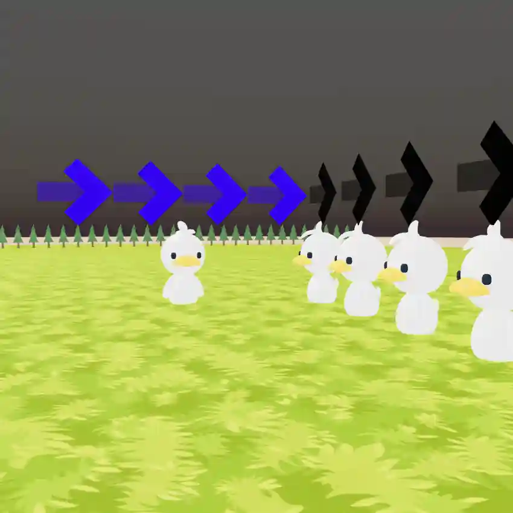

# Move Match

Compete to replay the pattern given to you the fastest with out players!



## Getting Started

First you will need to setup a .env file from the .env.sample provided.

Then development server can be run:

```bash
npm run dev
```

## Multiplayer

Aiming to have multiplayer via P2P and Websockets. Websocket backend code is not in this repo or available at this time. P2P code will be included here.

## Scripts

In the scripts folder is reset_public and sync_to_s3. This is only for Articles Media usage. Allows for putting public folder to CloudFront to lower Vercel charges for the public facing site.

## Inspiration

Recreation of the Move Match mini game from Disney's ToonTown Online.

## Attributions